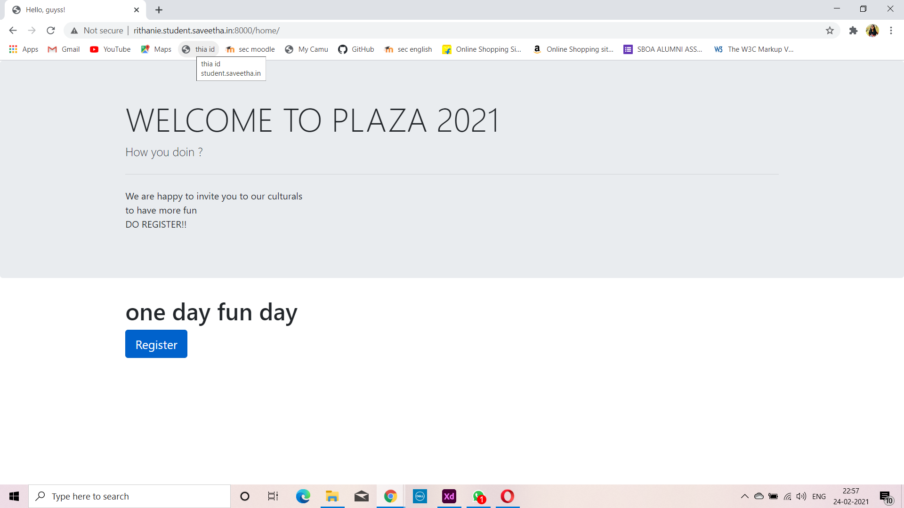

# WebApplication for Event Registration

## AIM:
To create a UX design and develop a web application for event registration.
## DESIGN STEPS:
### Step 1:
Create an UX design based on your requirements.

### Step 2:
Creating the layout using HTML and CSS.

### Step 3:
Updating the sample content.

### Step 4:
Choose the appropriate style and color scheme.

### Step 5:
Validate the layout in various browsers.

### Step 6:
Validate the HTML code.

### Step 7:
Create a database model and migrate the database.

### Step 8:
Retrieve data from database and display it in a dynamic webpage.

### Step 9:
Publish the website in the given URL.


## DESIGN SCREENS:


## WIREFRAME:


## PROTOTYPE:


## PROGRAM:
### HOME.HTML
```
<!doctype html>
<html lang="en">
  <head>
    <!-- Required meta tags -->
    <meta charset="utf-8">
    <meta name="viewport" content="width=device-width, initial-scale=1, shrink-to-fit=no">

    <!-- Bootstrap CSS -->
    <link rel="stylesheet" href="https://maxcdn.bootstrapcdn.com/bootstrap/4.0.0/css/bootstrap.min.css" integrity="sha384-Gn5384xqQ1aoWXA+058RXPxPg6fy4IWvTNh0E263XmFcJlSAwiGgFAW/dAiS6JXm" crossorigin="anonymous">

    <title>Hello, guyss!</title>
  </head>
  <body>
    <div class="jumbotron">
        <div class="container">
  <h1 class="display-4">WELCOME TO STACY 2021</h1>
  <p class="lead"> How you doin ? </p>
  <hr class="my-4">
  <p> We are happy to invite you to our culturals<br>
      to have more fun <br>
      DO REGISTER!!
  </p>
 
</div>
    </div>
    <div class="container">
        <div class="row">
            <div class="col-12">
                <h1> one day fun day</h1>

            </div>
        </div>
    </div>
    <div class="container">
        <div class="row">
            <div class="col-12">
                <a href="/registration" class="btn btn-primary btn-lg active" role="button" aria-pressed="true">Register</a>
            </div>
        </div>
    </div>    
    

    <!-- Optional JavaScript -->
    <!-- jQuery first, then Popper.js, then Bootstrap JS -->
    <script src="https://code.jquery.com/jquery-3.2.1.slim.min.js" integrity="sha384-KJ3o2DKtIkvYIK3UENzmM7KCkRr/rE9/Qpg6aAZGJwFDMVNA/GpGFF93hXpG5KkN" crossorigin="anonymous"></script>
    <script src="https://cdnjs.cloudflare.com/ajax/libs/popper.js/1.12.9/umd/popper.min.js" integrity="sha384-ApNbgh9B+Y1QKtv3Rn7W3mgPxhU9K/ScQsAP7hUibX39j7fakFPskvXusvfa0b4Q" crossorigin="anonymous"></script>
    <script src="https://maxcdn.bootstrapcdn.com/bootstrap/4.0.0/js/bootstrap.min.js" integrity="sha384-JZR6Spejh4U02d8jOt6vLEHfe/JQGiRRSQQxSfFWpi1MquVdAyjUar5+76PVCmYl" crossorigin="anonymous"></script>
  </body>
</html>
```
### REGISTRATION.HTML:
```
<!doctype html>
<html lang="en">

<head>
    <!-- Required meta tags -->
    <meta charset="utf-8">
    <meta name="viewport" content="width=device-width, initial-scale=1, shrink-to-fit=no">

    <!-- Bootstrap CSS -->
    <link rel="stylesheet" href="https://maxcdn.bootstrapcdn.com/bootstrap/4.0.0/css/bootstrap.min.css"
        integrity="sha384-Gn5384xqQ1aoWXA+058RXPxPg6fy4IWvTNh0E263XmFcJlSAwiGgFAW/dAiS6JXm" crossorigin="anonymous">

    <title>Saveetha Engineering College</title>
</head>

<body>
    <div class="jumbotron">
        <div class="container">
            <h1 class="display-4">Hello, Guys!</h1>
            <p class="lead">Welcome to our cultural program</p>
        </div>
    </div>
    <div class="container">
        <div class="row">
            <div class="col-12">
                <h1>Application</h1>
                <form method="POST" action="/registration/" >
                    


                    <div class="form-group">
                        <label for="exampleInputEmail1">NAME:</label>
                        <input type="name" class="form-control" id="name" aria-describedby="emailHelp"
                            placeholder="Enter name">
                        <small id="emailHelp" class="form-text text-muted">We'll never share your details with anyone
                            else.</small>
                    </div>
                    <div class="form-group">
                        <label for="exampleInputPassword1">EMAIL:</label>
                        <input type="email" class="form-control" id="exampleInputPassword1" placeholder="Email">
                    </div>
                    <div class="form-group">
                        <label for="exampleInputPassword1">PHONE NO. :</label>
                        <input type="number" class="form-control" id="exampleInputPassword1" placeholder="Phone number">
                    </div>

                    <button type="submit" class="btn btn-primary">Submit</button>
                </form>
                
                <!-- Optional JavaScript -->
                <!-- jQuery first, then Popper.js, then Bootstrap JS -->
                <script src="https://code.jquery.com/jquery-3.2.1.slim.min.js"
                    integrity="sha384-KJ3o2DKtIkvYIK3UENzmM7KCkRr/rE9/Qpg6aAZGJwFDMVNA/GpGFF93hXpG5KkN"
                    crossorigin="anonymous"></script>
                <script src="https://cdnjs.cloudflare.com/ajax/libs/popper.js/1.12.9/umd/popper.min.js"
                    integrity="sha384-ApNbgh9B+Y1QKtv3Rn7W3mgPxhU9K/ScQsAP7hUibX39j7fakFPskvXusvfa0b4Q"
                    crossorigin="anonymous"></script>
                <script src="https://maxcdn.bootstrapcdn.com/bootstrap/4.0.0/js/bootstrap.min.js"
                    integrity="sha384-JZR6Spejh4U02d8jOt6vLEHfe/JQGiRRSQQxSfFWpi1MquVdAyjUar5+76PVCmYl"
                    crossorigin="anonymous"></script>
</body>

</html>
```
### SUCCESS.HTML:
```
<!doctype html>
<html lang="en">
  <head>
    <!-- Required meta tags -->
    <meta charset="utf-8">
    <meta name="viewport" content="width=device-width, initial-scale=1, shrink-to-fit=no">

    <!-- Bootstrap CSS -->
    <link rel="stylesheet" href="https://maxcdn.bootstrapcdn.com/bootstrap/4.0.0/css/bootstrap.min.css" integrity="sha384-Gn5384xqQ1aoWXA+058RXPxPg6fy4IWvTNh0E263XmFcJlSAwiGgFAW/dAiS6JXm" crossorigin="anonymous">

    <title>YAAY!</title>
  </head>
  <body>
    <h1>CONGRATSS!! YOU APPLICATION HAS BEEN ACCEPTED!!</h1>
    <h2>now you are also a part of stacy's
    </h2>
    <a href="/home/" class="btn btn-primary btn-lg active" role="button" aria-pressed="true">Home</a>
    <!-- Optional JavaScript -->
    <!-- jQuery first, then Popper.js, then Bootstrap JS -->
    <script src="https://code.jquery.com/jquery-3.2.1.slim.min.js" integrity="sha384-KJ3o2DKtIkvYIK3UENzmM7KCkRr/rE9/Qpg6aAZGJwFDMVNA/GpGFF93hXpG5KkN" crossorigin="anonymous"></script>
    <script src="https://cdnjs.cloudflare.com/ajax/libs/popper.js/1.12.9/umd/popper.min.js" integrity="sha384-ApNbgh9B+Y1QKtv3Rn7W3mgPxhU9K/ScQsAP7hUibX39j7fakFPskvXusvfa0b4Q" crossorigin="anonymous"></script>
    <script src="https://maxcdn.bootstrapcdn.com/bootstrap/4.0.0/js/bootstrap.min.js" integrity="sha384-JZR6Spejh4U02d8jOt6vLEHfe/JQGiRRSQQxSfFWpi1MquVdAyjUar5+76PVCmYl" crossorigin="anonymous"></script>
  </body>
</html>

```
### ERROR.HTML:
```
<!doctype html>
<html lang="en">
  <head>
    <!-- Required meta tags -->
    <meta charset="utf-8">
    <meta name="viewport" content="width=device-width, initial-scale=1, shrink-to-fit=no">

    <!-- Bootstrap CSS -->
    <link rel="stylesheet" href="https://maxcdn.bootstrapcdn.com/bootstrap/4.0.0/css/bootstrap.min.css" integrity="sha384-Gn5384xqQ1aoWXA+058RXPxPg6fy4IWvTNh0E263XmFcJlSAwiGgFAW/dAiS6JXm" crossorigin="anonymous">

    <title>SORRY :(</title>
  </head>
  <body>
    <h1> THE SEATS ARE FILLED!!</h1>
    <h2> thank you for participating...
    </h2>

    <!-- Optional JavaScript -->
    <!-- jQuery first, then Popper.js, then Bootstrap JS -->
    <script src="https://code.jquery.com/jquery-3.2.1.slim.min.js" integrity="sha384-KJ3o2DKtIkvYIK3UENzmM7KCkRr/rE9/Qpg6aAZGJwFDMVNA/GpGFF93hXpG5KkN" crossorigin="anonymous"></script>
    <script src="https://cdnjs.cloudflare.com/ajax/libs/popper.js/1.12.9/umd/popper.min.js" integrity="sha384-ApNbgh9B+Y1QKtv3Rn7W3mgPxhU9K/ScQsAP7hUibX39j7fakFPskvXusvfa0b4Q" crossorigin="anonymous"></script>
    <script src="https://maxcdn.bootstrapcdn.com/bootstrap/4.0.0/js/bootstrap.min.js" integrity="sha384-JZR6Spejh4U02d8jOt6vLEHfe/JQGiRRSQQxSfFWpi1MquVdAyjUar5+76PVCmYl" crossorigin="anonymous"></script>
  </body>
</html>

```
### LISTOFPARTICIPANTS.HTML:
```
<!doctype html>
<html lang="en">

<head>
    <!-- Required meta tags -->
    <meta charset="utf-8">
    <meta name="viewport" content="width=device-width, initial-scale=1, shrink-to-fit=no">

    <!-- Bootstrap CSS -->
    <link rel="stylesheet" href="https://maxcdn.bootstrapcdn.com/bootstrap/4.0.0/css/bootstrap.min.css"
        integrity="sha384-Gn5384xqQ1aoWXA+058RXPxPg6fy4IWvTNh0E263XmFcJlSAwiGgFAW/dAiS6JXm" crossorigin="anonymous">

    <title>Saveetha Engineering College</title>
</head>

<body>
    <div class="jumbotron">
        <div class="container">
            <h1 class="display-4">STACY'S 2021</h1>
            <p class="lead"> Participants for Stacy's 2021</p>
            <hr class="my-4">
            <p></p>
            <p class="lead">
               
            </p>
        </div>
    </div>
    <div class="container">
        <div class="row">
            <div class="col-12">
                <h1>These are the lucky people:</h1>
            </div>
        </div>
        <div class="row">
            <div class="col-12">
                <table class="table">
                    <thead>
                        <tr>
                            <th scope="col">NAME</th>
                            <th scope="col">EMAIL</th>
                            <th scope="col">PHONE</th>
                            <th scope="col">INSTITUTION</th>
                        </tr>
                    </thead>
                    <tbody>
                        
                        <tr>                          
                            <td>kamal</td>
                            <td>raja@gmail.com</td>
                            <td>234242</td>
                            <td>saveetha</td>
                        </tr>
                        
                        <tr>                          
                            <td>kamal</td>
                            <td>raja@gmail.com</td>
                            <td>234242</td>
                            <td>saveetha</td>
                        </tr>
                        
                        <tr>                          
                            <td>otto</td>
                            <td>otto@gmail.com</td>
                            <td>123</td>
                            <td>Saveetha</td>
                        </tr>
                        
                        <tr>                          
                            <td>kala</td>
                            <td>sfsd</td>
                            <td>234</td>
                            <td>sdf</td>
                        </tr>
                        
                        <tr>                          
                            <td>sdfsd</td>
                            <td>sdf</td>
                            <td>234</td>
                            <td>sdfsd</td>
                        </tr>
                        
                        <tr>                          
                            <td>fsdfsd</td>
                            <td>sdf</td>
                            <td>sdf</td>
                            <td>sdf</td>
                        </tr>
                        
                        <tr>                          
                            <td>sdf</td>
                            <td>sdf</td>
                            <td>sdf</td>
                            <td>sdf</td>
                        </tr>
                        
                        <tr>                          
                            <td>sdf</td>
                            <td>sdf</td>
                            <td>sdf</td>
                            <td>sdf</td>
                        </tr>
                        
                        <tr>                          
                            <td>sdf</td>
                            <td>sdf</td>
                            <td>sdf</td>
                            <td>sdf</td>
                        </tr>
                        
                        <tr>                          
                            <td>sdf</td>
                            <td>sdf</td>
                            <td>sdf</td>
                            <td>sdf</td>
                        </tr>
                        
                        <tr>                          
                            <td>sdf</td>
                            <td>sdf</td>
                            <td>sdf</td>
                            <td>sdf</td>
                        </tr>
                        
                        <tr>                          
                            <td>sdf</td>
                            <td>sdf</td>
                            <td>sdf</td>
                            <td>sdf</td>
                        </tr>
                        
                        <tr>                          
                            <td>sdf</td>
                            <td>sdf</td>
                            <td>sdf</td>
                            <td>sdf</td>
                        </tr>
                        
                        <tr>                          
                            <td>sdf</td>
                            <td>sdf</td>
                            <td>sdf</td>
                            <td>sdf</td>
                        </tr>
                                                
                    </tbody>
                </table>
            </div>
        </div>
        <div class="row">
            <div class="col-12 text-center">
                <a href="/home/" class="btn btn-primary btn-lg" role="button" >Home</a>
            </div>
        </div>         
    </div>

    <!-- Optional JavaScript -->
    <!-- jQuery first, then Popper.js, then Bootstrap JS -->
    <script src="https://code.jquery.com/jquery-3.2.1.slim.min.js"
        integrity="sha384-KJ3o2DKtIkvYIK3UENzmM7KCkRr/rE9/Qpg6aAZGJwFDMVNA/GpGFF93hXpG5KkN"
        crossorigin="anonymous"></script>
    <script src="https://cdnjs.cloudflare.com/ajax/libs/popper.js/1.12.9/umd/popper.min.js"
        integrity="sha384-ApNbgh9B+Y1QKtv3Rn7W3mgPxhU9K/ScQsAP7hUibX39j7fakFPskvXusvfa0b4Q"
        crossorigin="anonymous"></script>
    <script src="https://maxcdn.bootstrapcdn.com/bootstrap/4.0.0/js/bootstrap.min.js"
        integrity="sha384-JZR6Spejh4U02d8jOt6vLEHfe/JQGiRRSQQxSfFWpi1MquVdAyjUar5+76PVCmYl"
        crossorigin="anonymous"></script>
</body>

</html>
```


## OUTPUT:



## VALIDATION REPORT


## RESULT:
Thus an UX design and a web application has been devloped for event registration. It is hosted in the URL http://rithanie.student.saveetha.in:8000/home/ . HTML code is validated.